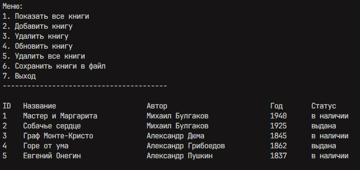
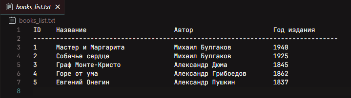
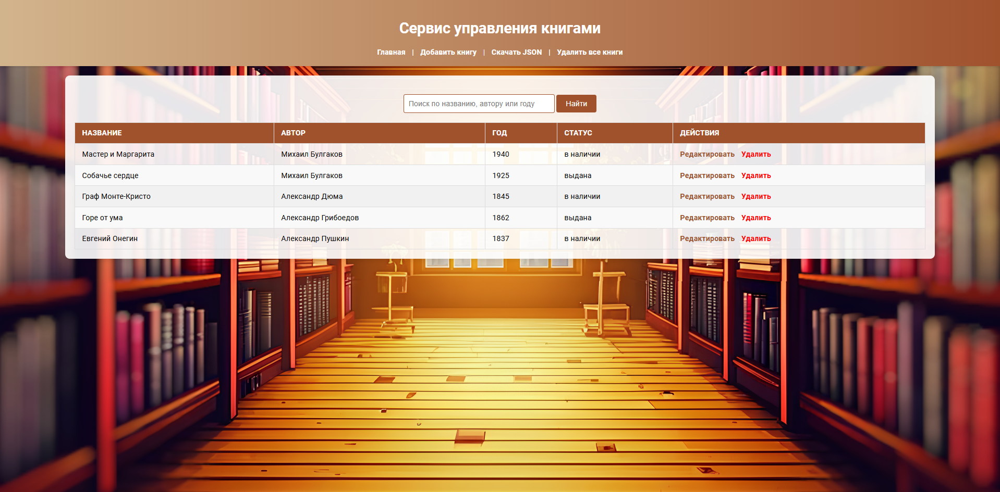
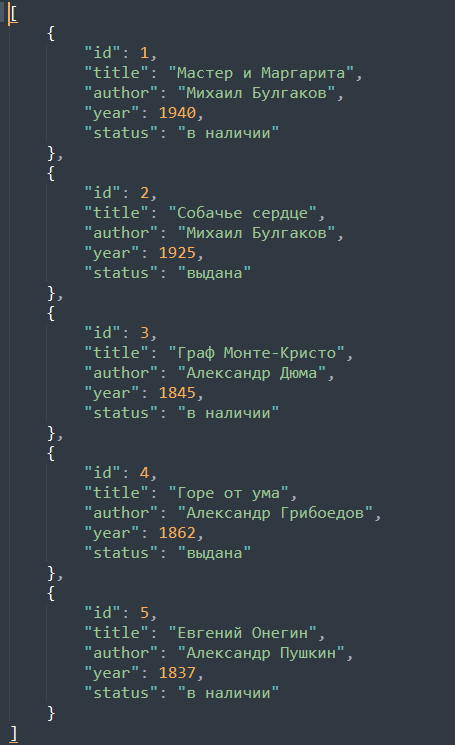

# Система Управления Книгами

Этот проект представляет собой систему управления книгами, которая позволяет пользователям управлять коллекцией книг через **веб-интерфейс** и **консольное приложение**. Система поддерживает добавление, поиск, обновление, удаление и отображение книг, а также хранение данных в формате JSON и возможность сохранения в текстовом файле. Каждая книга имеет такие свойства, как название, автор, год издания и статус, который указывает, доступна ли книга ("в наличии") или она выдана.


## Оглавление

- [Функционал](#функционал)
- [Установка](#установка)
- [Использование](#использование)
- [Реализация](#реализация)
- [Скриншоты](#скриншоты)


## Функционал

### Консольное Приложение
1. **Показать книги**: Отображает все книги в виде таблицы с колонками для ID, Названия, Автора, Года и Статуса.
2. **Добавить книгу**: Ввод данных о новой книге, которая будет добавлена в систему.
3. **Удалить книгу**: Удаляет книгу по её ID.
4. **Обновить книгу**: Позволяет обновить информацию о книге: название, автор, год издания и статус.
5. **Удалить все книги**: Удаляет все книги из системы.
6. **Сохранить в текстовый файл**: Сохраняет текущий список книг в текстовом файле для дальнейшего использования.

### Веб Приложение
1. **Список книг**: Отображает все книги в таблице на веб-странице.
2. **Добавить книгу**: Форма для ввода информации о новой книге.
3. **Обновить книгу**: Форма для редактирования существующих книг.
4. **Найти книгу**: Форма для поиск книги по автору, названию или году. 
5. **Удалить книгу**: Возможность удалить книгу по ID.
6. **Удалить все книги**: Возможность удалить все книги.
7. **Сохранение и загрузка JSON файла**: Возможность скачивания библиотеки в формате JSON.
8. **Изменение статуса книги**: Выбор между статусами "в наличии" и "выдана" для каждой книги.

## Используемые Технологии

- **Flask**: Легковесный фреймворк для создания веб-приложений.
- **CSS**: Для создания стилей веб страницы.
- **JavaScript**: Для создания динамического отображения.
- **Python 3**: Основной язык программирования для обеих частей проекта.
- **JSON**, **TXT**: Формат хранения данных о книгах.
- **OS**: Стандартная библиотека Python для работы с файловой системой.


## Установка

Для установки и запуска проекта необходимо выполнить следующие шаги:

1. Склонировать репозиторий:
    ```bash
    git clone https://github.com/RomanRizers/library_app
    cd library_app
    ```

2. Установить зависимости (для web-приложения):
    ```bash
    pip install -r requirements.txt
    ```

3. Запустить консольное приложение:
    ```bash
    python console.py
    ```

4. Запустить веб-приложение:
    ```bash
    python app.py
    ```

## Использование

### Веб-приложение
1. Перейдите в браузер и откройте [http://localhost:5000](http://localhost:5000).
2. Используйте интерфейс для добавления, обновления, удаления книг и изменения их статуса.

### Консольное приложение
Используйте меню для управления книгами через командную строку.


## Реализация

### Структура данных

Каждая книга представлена объектом класса `Book`, который имеет следующие атрибуты:

- `id` — уникальный идентификатор книги.
- `title` — название книги.
- `author` — автор книги.
- `year` — год издания книги.
- `status` — статус книги (в наличии или выдана).

Пример создания книги:
```python
book = Book(id=1, title="1984", author="Джордж Оруэлл", year=1949, status="в наличии")
```

### Реализация хранения данных: `json_storage` и `storage_strategy`

В проекте используется паттерн **Стратегия** для организации хранения данных о книгах. Паттерн Стратегия позволяет создавать различные механизмы хранения данных, не изменяя основную логику работы с объектами книг. В данном случае мы реализовали хранение данных в формате **JSON**.

#### 1. Стратегия хранения данных: `StorageStrategy`

`StorageStrategy` — это абстрактный базовый класс, который задает интерфейс для всех реализаций хранилищ данных. Его цель — определить общие методы, которые будут использоваться в различных типах хранилищ (например, JSON, база данных, файловая система и т. д.).

#### Описание методов:
- `add(book)`: добавляет книгу в хранилище.
- `load()`: позволяет загрузку книг с JSON файла.
- `sava()`: сохраняет информация о книгах в JSON файл.
- `delete_all()`: удаляет все книги.
- `delete(book_id)`: удаляет книгу по идентификатору.
- `get_items()`: возвращает все книги из хранилища.
- `get_item(book_id)`: возвращает книгу по ID.
- `update(book_id, book)`: обновляет информацию о книге по ID.

#### 2. Реализация хранилища JSON: `JSONStorage`

`JSONStorage` наследуется от абстрактного базового класса `StorageStrategy`, который определяет интерфейс для работы с хранилищем данных. Разумеется, что методы такие же, как и `StorageStrategy`
В свою очередь, класс `JSONStorage` реализует конкретные методы для работы с JSON-файлом, а именно для добавления, удаления, обновления и получения книг.

### `console.py` и `book_manager.py`

#### Файл `console.py`

Файл **`console.py`** является основной точкой входа для взаимодействия пользователя с приложением через консольный интерфейс. Он управляет пользователем через текстовое меню, позволяя выполнять операции с книгами, такие как добавление, удаление, обновление и вывод списка книг. 

##### Основные функции:
- **Запуск приложения** (`run`): Запускает цикл меню, предлагая пользователю выбрать одно из доступных действий.
- **Показать книги** (`show_books`): Отображает список всех книг в консоли в табличном виде.
- **Добавить книгу** (`add_book`): Получает данные от пользователя и добавляет книгу в хранилище.
- **Удалить книгу** (`delete_book`): Запрашивает ID книги и удаляет её из хранилища.
- **Обновить книгу** (`update_book`): Позволяет пользователю обновить информацию о книге, включая изменение названия, автора и года издания.
- **Удалить все книги** (`delete_all_books`): Удаляет все книги из хранилища.
- **Меню**: Предоставляет пользователю текстовое меню для выбора действия.

Вся логика, связанная с взаимодействием с хранилищем и выводом информации на экран, реализована внутри этих методов. Это простое консольное приложение с меню, которое позволяет быстро управлять коллекцией книг.

### Файл `book_manager.py`

Файл **`book_manager.py`** отвечает за обработку и управление данными о книгах. Он включает логику для добавления, удаления, обновления и получения книг из хранилища.

#### Основные функции:
- **`add_book`**: Добавляет книгу в хранилище. Генерирует уникальный ID для каждой новой книги.
- **`delete_book`**: Удаляет книгу по ID из хранилища.
- **`update_book`**: Обновляет информацию о книге, такую как название, автор и год издания. Также позволяет изменять статус книги.
- **`get_books`**: Возвращает список всех книг из хранилища.
- **`get_book`**: Возвращает конкретную книгу по ID.

Функции в **`book_manager.py`** являются интерфейсом для работы с объектами книг. Они взаимодействуют с классом хранилища `JSONStorage`, для выполнения операций над данными.

### Файл `app.py`

Файл **`app.py`** представляет собой точку входа для веб-приложения, основанного на **Flask**. В нем описан основной сервер и обработчики маршрутов для взаимодействия с пользователем через веб-интерфейс.

#### Основные функции:

1. **Инициализация приложения**:
   - В `app.py` создается и настраивается экземпляр Flask-приложения.
   - Подключаются все необходимые модули и конфигурации для работы с хранилищем данных `JSONStorage`, а также импортируются маршруты для обработки запросов.

2. **Маршруты**:
   - **Стартовая страница** (`/`): Домашняя привественная страница.
   - **Главная страница** (`/books`): Страница для отображения всего функционала сервиса.
   - **Добавление книги** (`/add`): Обрабатывает POST-запрос для добавления новой книги в хранилище. Здесь пользователь вводит данные о книге через форму.
   - **Удаление книги** (`/delete/<int:book_id>`): Удаляет книгу по указанному ID.
   - **Обновление книги** (`/update/<int:book_id>`): Обновляет данные книги, включая изменение статуса и других полей.
   - **Удалить все книги** (`/delete_all`): Удаляет все книги из базы данных.
   - **Загрузка JSON файла** (`/download`): Загружает JSON файл на локальное устройство.

3. **Шаблоны и форма**:
   - Для отображения данных и получения пользовательского ввода используются шаблоны Jinja. Все страницы интерфейса организованы в виде tpl-шаблонов, а данные передаются в шаблоны через контекст.
   - Формы на страницах позволяют пользователю вводить и отправлять данные для добавления или обновления информации о книгах.

4. **Запуск приложения**:
   - В конце файла содержится проверка, которая запускает сервер Flask при непосредственном исполнении `app.py`.


## Скриншоты

Консольное приложение:
<p align="center">
  
</p>

TXT файл:
<p align="center">
  
</p>

WEB приложение:
<p align="center">
  <p align="center">
  
  
  
  
</p>


JSON файл:
<p align="center">
  
</p>


